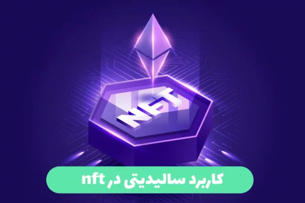

  

## کاربرد زبان سالیدیتی

زبان سالیدیتی (Solidity) یک زبان برنامه‌نویسی است که برای توسعه قراردادهای هوشمند در بلاکچین اتریوم استفاده می‌شود. این زبان به طور اخص برای توسعه قراردادهای هوشمند در پلتفرم Ethereum طراحی شده است و بر پایه زبان جاوااسکریپت (JavaScript) می‌باشد.

از قراردادهای هوشمند استفاده می‌شود تا قوانین و شرایط اجرایی را برای انتقال دارایی‌ها، انجام معاملات و صرفاً به عنوان یک قرارداد خودکار در بیت کوین و سایر بلاکچین‌ها تعریف کند. با استفاده از زبان سالیدیتی، می‌توانید قراردادهای هوشمندی ایجاد کنید که بتوانند به طور خودکار عملیات مالی و تجاری را انجام دهند و نیازی به واسطه‌گری وجود نداشته باشد.

با استفاده از سالیدیتی، می‌توانید قراردادهای هوشمندی را برنامه‌ریزی کنید که امنیت، شفافیت و دقت بالایی داشته باشند. این زبان بسیار قدرتمند است و امکانات گسترده‌ای برای برنامه‌نویسان فراهم می‌کند تا بتوانند برنامه‌های پیچیده و بزرگ را در بلاکچین اتریوم پیاده‌سازی کنند.

---

  

### هدف از نوشتن قرارداد هوشمند چیست؟

هدف اصلی از نوشتن قرارداد هوشمند در بلاکچین، به وجود آوردن یک قرارداد خودکار و قابل اجرا است که براساس شروط قبلی تعیین شده عمل کند و تغییراتی را در دارایی‌ها یا سیستم اعمال کند. مهمترین اهداف نوشتن قرارداد هوشمند عبارتند از:

1. اجرای خودکار: قراردادهای هوشمند برای انجام عملیات مشخصی طراحی می‌شوند و با توجه به شروط قبلی و ورودی‌های ارائه شده، به صورت خودکار اجرا می‌شوند. این به معنی این است که نیازی به واسطه‌گران بشری برای انجام تراکنش‌ها و انتقال دارایی‌ها نیست و فرآیند به طور خودکار و بدون تأخیر انجام می‌شود.

2. امنیت: قراردادهای هوشمند در بلاکچین توسط تکنولوژی رمزنگاری بهبود یافته‌اند که آنها را ایمن و مقاوم در برابر حملات ناشناخته و تغییرات ناخواسته می‌کند. با استفاده از قراردادهای هوشمند، اعتماد و امنیت بیشتری به هر تراکنش اضافه می‌شود.

3. شفافیت: بلاکچین اتریوم و سایر پلتفرم‌های بلاکچین عمومی، امکان دسترسی عمومی به قراردادهای هوشمند را فراهم می‌کنند. این به معنی این است که هر کسی می‌تواند قراردادهای هوشمند را بررسی کند و عملکرد آنها را بررسی کند. این روشی برای افزایش شفافیت و اعتماد در معاملات است.

4. از بین بردن واسطه‌ها: با استفاده از قراردادهای هوشمند، نیاز به واسطه‌گران معمولی، مثل بانک‌ها و سایر سازمان‌ها، برای انجام تراکنش‌ها وجود ندارد. این به معنی کاهش هزینه‌ها و زمان مورد نیاز برای انجام تراکنش‌ها است.

5- برنامه‌پذیری: قراردادهای هوشمند امکان برنامه‌نویسی و پیاده‌سازی منطق و قوانین سفارشی را فراهم می‌کنند. با استفاده از این قابلیت، می‌توان قراردادهای هوشمند پیچیده‌تری را برای انجام عملیات مختلف در یک شبکه بلاکچین تعریف کرد.

در قراردادهای هوشمند، می‌توانید منطق و قوانین دلخواه خود را با استفاده از زبان سالیدیتی برنامه‌ریزی کنید. شما می‌توانید بلوک‌ها از جمله شرایط قبول یک تراکنش، تحویل اموال، محاسبه کارمزد، حقوق مالکیت، اسکناس‌های قابل نقل و انتقال و سایر قوانین و منطق‌ها را برنامه‌ریزی کنید.

برنامه‌نویسی قراردادهای هوشمند با سالیدیتی به شما این امکان را می‌دهد که قوانین سفارشی خود را در قالب کدهای برنامه‌نویسی تعریف کنید. این کدها می‌توانند عملیات و رفتار قرارداد هوشمند را تحت کنترل قرار دهند و به شما اجازه می‌دهند قوانین خاصی را برای تعامل با NFT، امضا دیجیتالی، حقوق مالکیت مفروض و سایر جوانب را تعیین کنید.

به طور خلاصه، قراردادهای هوشمند با سالیدیتی به شما امکان برنامه‌ریزی و پیاده‌سازی منطق و قوانین سفارشی را می‌دهند تا قابلیت‌های پیچیده‌تری را در یک شبکه بلاکچین داشته باشید.

---

  

### چرا قرارداد هوشمد را با سالیدیتی برنامه نویسی میکنند؟

قراردادهای هوشمند را با زبان سالیدیتی برنامه‌نویسی می‌کنند به دلایل زیر:

1. سازگاری با بلاکچین اتریوم: زبان سالیدیتی به طور خاص برای توسعه قراردادهای هوشمند در بلاکچین اتریوم طراحی شده است. این زبان با بلاکچین اتریوم سازگاری بالایی دارد و مجموعه‌ای از کتابخانه‌ها و ابزارهایی را فراهم می‌کند که برای توسعه قراردادهای هوشمند در این بلاکچین استفاده می‌شوند.

2. امکانات پیشرفته: زبان سالیدیتی دارای امکانات پیشرفته‌ای است که به برنامه‌نویسان امکان می‌دهد قراردادهای هوشمند پیچیده‌تری را برنامه‌ریزی کنند. این زبان از قابلیت‌هایی مانند وراثت، مدیریت حافظه، الگوهای طراحی و بسیاری از ویژگی‌های دیگر پشتیبانی می‌کند که به برنامه نویسان امکان می‌دهد قراردادهای هوشمند قدرتمند، انعطاف‌پذیر و با کارایی بالا را پیاده‌سازی کنند.

3. امنیت: یکی از جوانمردانه‌ترین نقاط زبان سالیدیتی در توسعه قراردادهای هوشمند، امنیت بالای آن است. سالیدیتی به علت طراحی خاص خود برای بلاکچین و وجود مکانیزم‌هایی برای جلوگیری از آسیب‌پذیری‌ها و حملات امنیتی، برای ایجاد قراردادهای هوشمند امن و قابل اعتماد مناسب است.

4. توسعه‌پذیری: سالیدیتی یک زبان قدرتمند و توسعه‌پذیر است که با استفاده از آن می‌توان برنامه‌های پیچیده‌تری را در بلاکچین اتریوم پیاده‌سازی کرد. این زبان ابزارها و قابلیت‌هایی را فراهم می‌کند که به برنامه‌نویسان امکان می‌دهد با سرعت و کارایی بالا قراردادهای هوشمند را توسعه دهند.

با توجه به این مزایا، استفاده از زبان سالیدیتی برای برنامه‌نویسی قراردادهای هوشمند محبوبیت بالایی را به دست آورده است.

---

  

### بر روی چه اکوسیسیتم هایی میشود با زبان سالیدیتی برنامه نوشت ؟( کاربرد سالیدیتی در کریپتو)

زبان سالیدیتی (Solidity) اصلاح شده‌ای از زبان سوالی‌قلمی است که برای توسعه قراردادهای هوشمند در بلاکچین اتریوم استفاده می‌شود. دستورات و ویژگی‌های زبان سالیدیتی به طور عمده بر اساس زبان‌های معمول برنامه‌نویسی مانند JavaScript و C++ الهام گرفته‌اند.

با استفاده از زبان سالیدیتی، می‌توانید قراردادهای هوشمند را بر روی بلاکچین اتریوم بنویسید و از آن در اکوسیستم‌های زیر استفاده کنید:

1. بلاکچین اتریوم: زبان سالیدیتی به طور اصلی برای توسعه قراردادهای هوشمند در بلاکچین اتریوم استفاده می‌شود. با استفاده از زبان سالیدیتی، می‌توانید قراردادهای هوشمند را برای استفاده در بلاکچین اتریوم توسعه دهید و عملیات‌هایی مانند تراکنش‌ها و مدیریت دارایی‌ها را برنامه‌ریزی کنید.

2. پلتفرم‌های DeFi: با رشد صنعت مالی سازگار با دی‌فای (DeFi)، زبان سالیدیتی نقش مهمی در توسعه قراردادهای هوشمند برای پروتکل‌ها و سرویس‌های مالی غیرمتمرکز بازی می‌کند. قراردادهای هوشمند ساخته شده با سالیدیتی می‌توانند در اکوسیستم‌های مانند اعتباردهی، حوزه‌های نمادین، قرض‌دهی و تجارت جابه‌جا شونده استفاده شوند.

3. اپلیکیشن‌های NFT: با رشد عصر فناوری غیرقابل تعویض (NFT)، زبان سالیدیتی به عنوان یکی از زبان‌های اصلی برای توسعه قراردادهای هوشمند NFT مورد استفاده قرار می‌گیرد. با سالیدیتی، می‌توانید منطق و قوانین خاصی را برای NFT خود تعیین کنید و عملکردهای مختلفی را برای آنها پیاده‌سازی کنید.

4. اکوسیستم‌های Defi: زبان سالیدیتی در توسعه قراردادهای هوشمند برای اکوسیستم‌های DeFi (مالی غیرمتمرکز) نظیر اتریوم استفاده می‌شود. از جمله دسته‌هایی که می‌توانید با استفاده از سالیدیتی توسعه دهید.

### شبکه هایی که با سالیدیتی کار میکنند؟

زبان سالیدیتی (Solidity) اصلاح شده‌ای از زبان سوالی‌قلمی است که برای توسعه قراردادهای هوشمند در بلاکچین اتریوم استفاده می‌شود. بنابراین، شبکه‌هایی که با سالیدیتی کار می‌کنند، به طور عمده شبکه بلاکچین اتریوم و شبکه‌های مبتنی بر بلاکچین اتریوم هستند.

به عنوان مثال، شبکه اصلی بلاکچین اتریوم (Ethereum Mainnet) از قراردادهای هوشمند ساخته شده با سالیدیتی استفاده می‌کند. همچنین، شبکه‌های تست بلاکچین اتریوم مانند Rinkeby، Ropsten، Kovan و Göerli نیز از سالیدیتی برای قراردادهای هوشمند خود استفاده می‌کنند.

علاوه بر شبکه اتریوم، برخی از بلاکچین‌های دیگر همچنین از سالیدیتی برای قراردادهای هوشمند خود استفاده می‌کنند. به عنوان مثال، بلاکچین Binance Smart Chain (BSC) و بلاکچین Polygon (قبلاً به عنوان Matic شناخته می‌شد) از سالیدیتی برای توسعه قراردادهای هوشمند در شبکه خود استفاده می‌کنند.

لطفا توجه داشته باشید که هر شبکه بلاکچین ممکن است نسخه خاصی از زبان سالیدیتی را پشتیبانی کند و ممکن است به تطابق با نسخه‌ها و ویژگی‌های مشخصی نیاز داشته باشید تا قراردادهای هوشمند خود را در هر شبکه بلاکچین پیاده‌سازی کنید.

---

  

### کاربرد سالیدیتی در nft

زبان سالیدیتی (Solidity) یکی از زبان‌های اصلی استفاده شده در توسعه قراردادهای هوشمند برای NFT (غیرقابل تعویض Token). در ادامه، به برخی از کاربردهای سالیدیتی در NFT می‌پردازیم:

1. ایجاد قراردادهای هوشمند NFT: با استفاده از سالیدیتی، می‌توانید قراردادهای هوشمند NFT را برنامه‌ریزی و پیاده‌سازی کنید. شما می‌توانید منطق و قوانین خاصی را برای NFT خود تعیین کنید، از جمله توزیع و فروش NFT، مالکیت و انتقال آن، قوانین دسترسی و استفاده از NFT و سایر عملیات مرتبط.

2. پیاده‌سازی استانداردهای NFT: با سالیدیتی، می‌توانید استانداردهای NFT معروف و شناخته شده مانند ERC-721 و ERC-1155 را پیاده‌سازی کنید. این استانداردها مشخصات و قوانینی را برای NFT تعیین می‌کنند و به شما امکان می‌دهند تا با سایر قراردادهای هوشمند NFT در خودخواهی و تعامل کنید.

3. تعریف ویژگی‌های NFT: با سالیدیتی، می‌توانید ویژگی‌های منحصربفردی را برای NFT خود تعریف کنید. مثلاً می‌توانید ویژگی‌های مانند نام، توضیحات، عکس یا ویدئوهای مرتبط، صاحبان قبلی، سابقه تراکنش‌ها و سایر جزئیات را به هر NFT اضافه کنید.

4. توسعه بازارچه‌های NFT: با سالیدیتی، می‌توانید قراردادهای هوشمند برای ایجاد بازارچه‌های NFT توسعه دهید. این قراردادها می‌توانند قابلیت‌هایی مانند خرید و فروش NFT، حراجی‌ها، مزایده‌ها، تعیین قیمت و سایر عملیات مربوط به بازارچه NFT را فراهم کنند.

5. اجرای منطق و قوانین خاص: با استفاده از سالیدیتی، می‌توانید صورت‌بندی دقیق‌تری برای NFT خود ایجاد کنید و قوانین مرتبط با حقوق مالکیت، کارمزد، انتقال و سایر جوانب را تعیین کنید.

برنامه‌پذیری: قراردادهای هوشمند امکان برنامه‌نویسی و پیاده‌سازی منطق و قوانین سفارشی را فراهم می‌کنند. با استفاده از این قابلیت، می‌توان قراردادهای هوشمند پیچیده‌تری را برای انجام عملیات مختلف در یک شبکه بلاکچین تعریف کرد.

در قراردادهای هوشمند، می‌توانید منطق و قوانین دلخواه خود را با استفاده از زبان سالیدیتی برنامه‌ریزی کنید. شما می‌توانید بلوک‌ها از جمله شرایط قبول یک تراکنش، تحویل اموال، محاسبه کارمزد، حقوق مالکیت، اسکناس‌های قابل نقل و انتقال و سایر قوانین و منطق‌ها را برنامه‌ریزی کنید.

برنامه‌نویسی قراردادهای هوشمند با سالیدیتی به شما این امکان را می‌دهد که قوانین سفارشی خود را در قالب کدهای برنامه‌نویسی تعریف کنید. این کدها می‌توانند عملیات و رفتار قرارداد هوشمند را تحت کنترل قرار دهند و به شما اجازه می‌دهند قوانین خاصی را برای تعامل با NFT، امضا دیجیتالی، حقوق مالکیت مفروض و سایر جوانب را تعیین کنید.

سالیدیتی (Solidity) به عنوان یک زبان برنامه‌نویسی قدرتمند و پرکاربرد در توسعه و پیاده‌سازی قراردادهای هوشمند بسیار مفید است. این زبان برای توسعه قراردادهای هوشمند بر روی بلاکچین اتریوم طراحی شده است و دارای ویژگی‌ها و امکاناتی است که برنامه‌نویسان را در توسعه قراردادهای هوشمند پیشرفته و پیچیده یاری می‌دهد.

با استفاده از سالیدیتی، می‌توانید منطق و قوانین خاص را به صورت قابل‌برنامه‌ریزی در قراردادهای هوشمند تعریف کنید. شما می‌توانید عملیاتی مانند تغییر اموال، تحویل، محاسبه کارمزد، تعیین حقوق مالکیت، تعامل با NFT و سایر امکانات را با استفاده از سالیدیتی پیاده‌سازی کنید.

سالیدیتی به شما اجازه می‌دهد قراردادهای هوشمند خود را در بستر بلاکچین اتریوم تبدیل به برنامه‌های کامل کنید. برنامه‌هایی که با استفاده از سالیدیتی نوشته می‌شوند، قابلیت‌های پیچیده‌تری مانند تعامل با دیگر قراردادهای هوشمند، ایجاد عقود هوشمند و اجرای منطق تجاری را دارا می‌باشند.

بنابراین، با استفاده از سالیدیتی به عنوان زبان برنامه‌نویسی، می‌توانید قراردادهای هوشمند پیچیده و کاملی را پیاده‌سازی کنید و عملکرد و منطق خاصی را در شبکه بلاکچین اتریوم تعریف کنید.

### چرا قرارداد هوشمند را با سالدیتی مینویسند؟

قراردادهای هوشمند با استفاده از زبان سالیدیتی نوشته می‌شوند به دلایل زیر:

1. سازگاری با بلاکچین اتریوم: سالیدیتی در اصل برای توسعه قراردادهای هوشمند بر روی بلاکچین اتریوم طراحی شده است. زبان سالیدیتی با ویژگی‌های خود، امکاناتی را فراهم می‌کند که به برنامه‌نویسان اجازه می‌دهد قراردادهای هوشمند پیچیده را بر روی بلاکچین اتریوم پیاده‌سازی کنند.

2. قدرتمند و کامل بودن: سالیدیتی یک زبان برنامه‌نویسی کامل و قدرتمند است که از ویژگی‌ها و دستوراتی برخوردار است که برای توسعه قراردادهای هوشمند مناسب است. این زبان ابزارها و کتابخانه‌هایی را در اختیار برنامه‌نویسان قرار می‌دهد که فرآیند توسعه، تست و بهینه‌سازی قراردادهای هوشمند را آسانتر می‌کند.

3. استفاده از اکوسیستم و استانداردها: با استفاده از سالیدیتی، می‌توانید از اکوسیستم و استانداردهای بلاکچین اتریوم بهره‌برداری کنید. به عنوان مثال، استانداردهای NFT مانند ERC-721 و ERC-1155 در اتریوم با استفاده از سالیدیتی پیاده‌سازی شده‌اند و شما می‌توانید از این استانداردها استفاده کنید تا NFT خود را با سایر قراردادهای هوشمند NFT سازگار کنید.

4. امنیت و جامعه بزرگ: سالیدیتی یک زبان با جامعه بزرگی از برنامه‌نویسان حرفه‌ای است که از طریق آن می‌توانید در صنعت قراردادهای هوشمند شرکت کنید. با اینکه هیچ زبان برنامه‌نویسی به طور کامل خطاها را از بین نمی‌برد، وجود یک جامعه فعال و بزرگ از برنامه‌نویسان سالیدیتی می‌تواند در تشخیص و رفع خطاها کمک کند و امنیت عمومی قراردادها را افزایش دهد.

به طور کلی، استفاده از سالیدیتی به برنامه‌نویسان امکان می‌دهد تا قراردادهای هوشمند پیچیده را بر روی بلاکچین اتریوم یا بلاکچین های evm base دیگر پیاده سازی کنند.

<a href="https://docs.soliditylang.org/en/v0.8.20/">داکیومت زبان سالدیتی </a>
### آیا با سالیدیتی میشود اپ نوشت؟

سالیدیتی (Solidity) در اصل یک زبان برنامه‌نویسی برای توسعه قراردادهای هوشمند بر روی بلاکچین اتریوم است و بیشتر برای توسعه قراردادهای هوشمند و عقد معاملات در بستر بلاکچین به کار می‌رود. از این رو، سالیدیتی برای توسعه نرم‌افزارهای کامل و گسترده که نیازمند واسط کاربری و منطق کاربردی بیشتری هستند، بهترین گزینه نیست.

با این حال، شما می‌توانید با استفاده از سالیدیتی قسمتی از نرم‌افزار خود را پیاده‌سازی کنید. به عنوان مثال، می‌توانید بخشی از منطق کاربردی خود را در قرارداد هوشمند تعریف کرده و از آن برای دسترسی و تغییر اطلاعات در بلاکچین استفاده کنید.

بنابراین، برای نوشتن یک اپلیکیشن کامل، بهتر است از زبان‌ها و فریمورک‌های برنامه‌نویسی مناسب‌تری مانند جاوااسکریپت، پایتون یا روبی استفاده کنید. این زبان‌ها و فریمورک‌ها ابزارها و کتابخانه‌های بسیاری را برای توسعه نرم‌افزارهای کامل و با واسط کاربری قدرتمند فراهم می‌کنند.