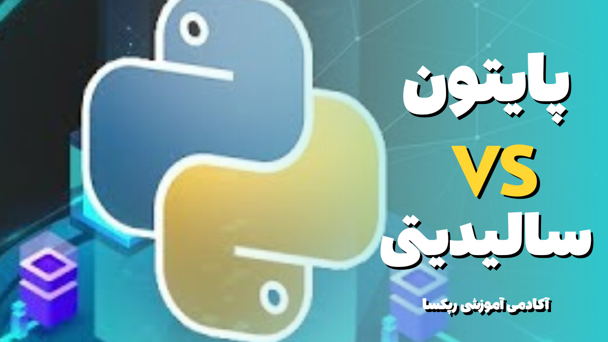

  

## پایتون یا سالیدیتی

پایتون یا سالیدیتی مسئله این سان چرا انتخاب سخت است؟ برای این انتخاب سخت هست که این دو زبان هر دو دارای ویژگی هایی منحصر به فردی است که که در دنیا بلاکچین حرف های زیادی برای گفتن دارد از طرفی طرفدداران ۲ آتیشه این دو زبان هم کم نیستند که کامینیتی زبان پایتون فعلا نسبت به سالیدیت بزرگ تر و گسترده است اما زبان سالیدیت که عمر چندانی هم ندارد جز پایه گذاران اینترنت وب ۳ است که تحولات بزرگی را قرار است رقن بزند، با ما برای مقایسه این زبان محبوب همراه باشید.

به دلیل گسترش سریع فضای وب ۳، توسعه دهندگان به طور فزاینده‌ای خواستار ایجاد زیرساخت های لازم برای فضای وب ۳ هستند. این موضوع که از کدام زبان برنامه نویسی هنگام نوشتن کد برای وب ۳ استفاده می‌شود، موضوعی است که توسط تعداد زیادی از برنامه نویسان مبتدی که قصد دارند برنامه نویسی برای وب ۳ را شروع کنند، به آن فکر می‌کنند. این مورد یک واقعیت کاملاً شناخته شده است که سالیدیتی محبوب ترین زبان برای توسعه وب ۳ است. بنابراین یک سوال تکراری در ذهن توسعه دهندگان جدید وجود دارد: آیا سالیدیتی شبیه پایتون است؟

همانطور که رایج است، زبان‌های برنامه نویسی شامل قوانینی هستند که با رعایت آنها، رشته هایی از متن و شکل‌ها را به کدهایی تبدیل می‌کنند که کامپیوتر می‌تواند بخواند. زبان‌های برنامه نویسی، در ابتدایی ترین شکل خود، چیزی هستند که به کامپیوترها امکان می‌دهند دستورالعمل هایی را که انسان وارد می‌کند، درک کند. سالیدیتی، پایتون و جاوااسکریپت از جمله زبان‌هایی هستند که اغلب در بخش بلاکچین مورد استفاده قرار می‌گیرند. با این حال، هر کدام به طور متمایز عمل می‌کنند.

سالیدیتی یک زبان براکتی است، به این معنی که از براکت‌های یا بهتر بگیم کرلی براکت‌ها برای محصور کردن بلوک‌ها استفاده می‌شود، برخلاف زبان‌هایی مانند پایتون که بلوک‌ها با دندانه گذاری تعریف می‌شوند.

### پایتون یا سالیدیتی؟

در ابتدا بهتره بگیم که میتونید مقالات مربوط به اینکه سالیدیتی چیست و درآمد سالیدیتی هم داخل وبسایت مشاهده کنید. خوب تو این مقاله هم یه کلیاتی رو دباره سالیدیتی خدمتتون میگیم:

سالیدیتی زبان برنامه نویسی اولیه برای توسعه قراردادهای هوشمند در بلاکچین اتریوم و یک زبان قرارداد محور است. در نتیجه، قراردادهای هوشمند مسئول ذخیره منطق برنامه‌نویسی در تعامل با بلاکچین هستند.

زبان برنامه نویسی سطح بالا که به صورت ایستا تایپ می‌شود شباهت‌های قابل توجهی با زبان‌های محبوبی مانند پایتون، سی پلاس پلاس و جاوا اسکریپت دارد. مهمتر از همه، سالیدیتی برای کار بر روی ماشین مجازی اتریوم یا EVM طراحی شده است که بر روی نودهای اتریوم مرتبط با بلاکچین میزبانی می‌شود.

اساسا، اهمیت برنامه نویسی سالیدیتی برای بلاکچین اتریوم در توانایی توسعه برنامه‌های بلاکچین در سطح صنعتی است. این توسط تیم شبکه اتریوم، به ویژه برای طراحی و ایجاد قراردادهای هوشمند بر روی پلتفرم های بلاکچین ایجاد شده است.

سالیدیتی به ایجاد قراردادهای هوشمند کمک می‌کند، که می تواند اجرای منطق کسب و کار را به دنبال ایجاد زنجیره‌ای از سوابق تراکنش در سیستم بلاکچین تضمین کند. عملکرد اولیه سالیدیتی بر توسعه کد در سطح ماشین در کنار تسهیل کامپایل کد در ماشین مجازی اتریوم یا EVM تمرکز دارد. طراحی سالیدیتی نیز مشابه سایر زبان‌های برنامه نویسی است و شامل متغیرها، کلاس‌ها، عملیات حسابی، توابع، دستکاری رشته‌ها و مفاهیم دیگر است.

رشد برنامه نویسی سالیدیتی در اتریوم یکی دیگر از نکات مهم در مقدمه‌ای بر زبان توسعه قرارداد هوشمند است. این زبان یک زبان نسبتاً جدید است که به سرعت با پیشرفت‌های قطعی بسیاری در حال رشد است. در حال حاضر، این زبان اصلی برای توسعه قراردادهای هوشمند در اتریوم است.

علاوه بر این، به قراردادهای برنامه نویسی هوشمند برای سایر شبکه‌های بلاکچین خصوصی در پلتفرم‌های رقیب مانند Monax نیز کمک می‌کند. Monax از بلاکچین Hyperledger Burrow استفاده می‌کند که برای اطمینان از اجماع بر پروتکل Tendermint متکی است. علاوه بر این، SWIFT همچنین اثبات مفهومی را توسعه داده است که بر روی بلاکچین Burrow اجرا می‌شود و از زبان برنامه نویسی سالیدیتی استفاده می‌کند.

### دیتا تایپ‌های سالیدیتی

طراحی زبان برنامه نویسی سالیدیتی شباهت‌های زیادی با زبان های سطح بالا مانند C++ ،پایتون و جاوا اسکریپت دارد. به عنوان یک زبان برنامه نویسی شی گرا، انواع داده‌‌ها در Solidity مشابه سایر زبان‌های OOP هستند. برخی از انواع داده‌های رایج که در زبان های OOP پشتیبانی می‌شوند و می‌توانید با سالیدیتی پیدا کنید عبارتند از Boolean، Integer، String، Array و Modifier.

### اجرای کد در برنامه نویسی سالیدیتی

دانش شما در مورد برنامه نویسی سالیدیتی برای بلاکچین اتریوم نیز به میزان آشنایی شما با اجرای برنامه‌های سالیدیتی بستگی دارد. شما می توانید دو روش متمایز برای اجرای یک برنامه سالیدیتی پیدا کنید، مانند حالت آنلاین و آفلاین.

<ul>
 	<li>
<h4><strong>حالت آفلاین</strong></h4>
</li>
</ul>
اولین انتخاب برای اجرای قراردادهای هوشمند سالیدیتی EVM به حالت آفلاین عملیات اشاره دارد. با این حال، رعایت سه شرط مهم قبل از اجرای قرارداد هوشمند سالیدیتی در حالت آفلاین مهم است. اولین شرط مهم برای اجرای قرارداد هوشمند سالیدیتی در حالت آفلاین، دانلود و نصب node.js است. همچنین باید Truffle و Ganache-CLI را به عنوان پیش نیازهای اجرای قراردادهای هوشمند در سالیدیتی در حالت آفلاین نصب کنید.

<ul>
 	<li>
<h4><strong>حالت آنلاین</strong></h4>
</li>
</ul>

فرآیند استفاده از برنامه نویسی سالیدیتی در اتریوم نیز انعطاف پذیری برای اجرای کد در محیط های آنلاین را ارائه می‌دهد. Remix IDE به عنوان بهترین انتخاب برای هر کسی که علاقه مند به کامپایل و اجرای قراردادهای هوشمند سالیدیتیاست عمل می‌کند.

### ساختارهای داده در سالیدیتی

برای شروع برنامه نویسی سالیدیتی نمی‌توانید ساختارهای داده را در یک راهنما از دست بدهید، زیرا آنها عملکردهای مهمی را ارائه می‌دهند. یکی از اولین ساختارهای داده به ساختار داده Enum اشاره دارد که به حفظ ردیابی لیست‌های شمارش شده در زبان برنامه نویسی سالیدیتی کمک می کند. Struct یا ساختارها نمونه دیگری از ساختارهای داده محبوب هستند که به تعریف انواع داده های خود کمک می کنند. ساختارها اساساً می‌توانند به شما در مدل‌سازی هر نوع داده با توجه به نیازها با ویژگی‌های دلخواه انواع داده‌های مختلف کمک کنند. به طور مشابه، شما همچنین می توانید با آرایه ها به عنوان یکی از ورودی های مهم در میان ساختارهای داده در برنامه نویسی سالیدیتی روبرو شوید.

در همین میان میتونیم به این اشاره کنیم که باید نوع داده رو تو سالیدیتی مشخص کنیم.

#### خوب، حالا موارد مهم پایتون رو بررسی کنیم:

پایتون یک زبان برنامه نویسی شی گرا است که توسعه سریع برنامه را ارائه می‌دهد که در سال ۱۹۹۱ توسط Guido van Rossum منتشر شد. به دلیل داشتن گزینه‌ها و تایپ پویا، تقاضای زیادی در توسعه سریع برنامه دارد. برخی از ویژگی های پایتون که آن را به محبوب ترین زبان برنامه نویسی در حال حاضر تبدیل می‌کند این است که رایگان و منبع باز است، کتابخانه استاندارد وسیعی دارد و می توان آن را به راحتی با سایر زبان‌های برنامه نویسی ادغام کرد.

پایتون یک زبان برنامه نویسی همه منظوره است که اغلب برای نقش‌های اسکریپت نویسی استفاده می‌شود. زبان‌های اسکریپت معمولاً محدود هستند، اما پایتون، از سوی دیگر، یک زبان برنامه‌نویسی بدون پیچیدگی و قوی است که هم قدرت و هم پیچیدگی سبک سنتی را ارائه می‌دهد. پایتون طوری طراحی شده است که در نوشتن و به خصوص خواندن بسیار کارآمد باشد.

### ویژگی‌های پایتون

قابل دسترسی به کد: پایتون یک زبان برنامه نویسی بسیار کاربرپسند است که امکان درک سریع و آسان را برای توسعه دهندگان فراهم می‌کند. در مقایسه با سایر زبان‌های شی گرا مانند جاوا، سی، سی پلاس پلاس و سی شارپ، درک پایتون نسبتاً ساده است.

منبع باز و رایگان: پایتون یک زبان برنامه نویسی متن باز است که هر کسی می‌تواند ایجاد کند و در توسعه آن مشارکت داشته باشد. همچنین، پایتون برای دانلود و استفاده در هر سیستم عاملی مانند ویندوز، مک یا لینوکس رایگان است.

پشتیبانی از رابط کاربری گرافیکی: رابط کاربری گرافیکی یا رابط کاربری گرافیکی یکی از جنبه های مهم هر زبان برنامه نویسی است زیرا می تواند به کدها جذابیت بیشتری بدهد و نتایج را بصری‌تر کند. پایتون از بسیاری از آرایه‌های رابط کاربری گرافیکی پشتیبانی می‌کند که به راحتی به مفسر وارد می‌شوند و آن را به یکی از محبوب‌ترین زبان‌ها برای توسعه‌دهندگان تبدیل می‌کنند.

زبان سطح بالا: پایتون به عنوان یک زبان برنامه نویسی سطح بالا طراحی شده است. وقتی در پایتون کدنویسی می‌کنید، نیازی نیست که ساختار کدنویسی، معماری و مدیریت حافظه شما را اذیت کند.

آرایه گسترده کتابخانه: پایتون دارای کتابخانه های داخلی عظیمی است که می‌توان آنها را در هر جایی وارد کرد و در یک برنامه خاص استفاده کرد. وجود کتابخانه ها همچنین تضمین می کند که می‌توانید همان را از کتابخانه های موجود در کتابخانه ها وارد کنید.

  

### ۷ کاربرد عملی پایتون

<ul>
 	<li>
<h4><strong>سیستم‌های عامل</strong></h4>
</li>
</ul>

کتابخانه استاندارد قوی پایتون آن را برای ساخت کل سیستم عامل‌ها عالی می‌کند. طراحی شی گرا زبان تضمین می‌کند که پروژه های بزرگ به راحتی مدیریت می شوند. پایتون با اکثر سیستم عامل ها سازگار است و به راحتی می‌توان از آن برای ساخت برنامه‌های بومی برای رایانه های ویندوز و مک استفاده کرد.

<ul>
 	<li>
<h4><strong>توسعه وب و اینترنت</strong></h4>
</li>
</ul>

پایتون چندین گزینه برای پروژه های پیچیده توسعه وب ارائه می دهد. HTML و جاوا اسکریپت زبان های اصلی هستند که برای ساختن قسمت فرانت یک برنامه استفاده می شوند. اما چارچوب‌ یا فریمورک‌ها وب مبتنی بر پایتون مانند جنگو، پیرامید و فلاسک برای مدیریت سمت سرور سایت‌ها و سرویس‌هایی مانند Spotify، Reddit و Mozilla استفاده می‌شوند. پلتفرم‌های غول پیکری مانند گوگل و یوتیوب برای زیرساخت های حیاتی تا حد زیادی به پایتون وابسته هستند.

کتابخانه استاندارد پایتون همچنین از بسیاری از پروتکل‌های اینترنتی مانند HTML و XML، JSON، پردازش ایمیل، FTP و IMAP پشتیبانی می‌کند.

<ul>
 	<li>
<h4><strong>توسعه بازی</strong></h4>
</li>
</ul>

درست مانند توسعه وب، پایتون مجموعه‌ای از ابزارها و کتابخانه‌ها را برای توسعه بازی ارائه می‌دهد. آیا باور می کنید، Battlefield 2 – یکی از محبوب ترین بازی های تیراندازی در اوایل دهه ۲۰۰۰، با استفاده از پایتون توسعه یافت.

<ul>
 	<li>
<h4><strong>محاسبات علمی و عددی</strong></h4>
</li>
</ul>

اکوسیستم پایتون ابزارها و کتابخانه های متعددی را ارائه می دهد که به دانشمندان و محققان در محاسبات علمی و عددی کمک می‌کند.

<ul>
 	<li>
<h4><strong>هوش مصنوعی و یادگیری ماشینی</strong></h4>
</li>
</ul>

داغ ترین کلمات این دهه – هوش مصنوعی (AI) و یادگیری ماشینی بیشتر در مورد الگوریتم‌ها، کدها و منطق هستند. پایتون، همراه با چند زبان برنامه نویسی دیگر، به طور فزاینده‌ای برای توسعه راه حل‌های مبتنی بر هوش مصنوعی و ML استفاده می شود. دامنه و قدرت پایتون در کنار ثبات و امنیت آن، آن را برای اجرای سیستم های هوش مصنوعی و ML ایده آل کرده است.

<ul>
 	<li>
<h4><strong>برنامه های کاربردی تجاری</strong></h4>
</li>
</ul>

کاربردهای پایتون همچنین شامل ساخت سیستم های ERP و تجارت الکترونیک است. برنامه‌های کاربردی تجاری با نرم افزارهای مصرف کننده معمولی متفاوت هستند، زیرا آنها مجموعه ای از ویژگی های خاص را به جای ویژگی های متنوع ارائه می دهند. علاوه بر این، آنها یک گروه کاربری بسیار فشرده، معمولا یک سازمان را هدف قرار می دهند.

### حقوق و درآمدهای پایتون

داخل مقاله قبلی در مورد درآمدهای سالیدیتی صحبت کردیم، در ادامه مطلب درآمدهای پایتون رو بررسی می‌کنیم. شرکت‌های فناوری چندملیتی به طور مداوم به دنبال افراد حرفه ای ماهر در زبان برنامه نویسی پایتون هستند و این امر باعث افزایش جستجو برای مشاغل پایتون می‌شود. جستجوهای مرتبط با حقوق و دستمزد نیز به صدر پورتال های شغلی معروف کشیده می شوند. نقش‌های توسعه‌دهنده پایتون از دانشمند داده تا توسعه دهنده اپ، Sys Admins تا مهندس دوآپز و توسعه دهنده وب متفاوت است. در زیر میانگین دستمزد توسعه دهندگان پایتون برای این نقش های مختلف آمده است:

دانشمند داده: ۷۸۴۵۶ دلار در سال

مهندس دوآپز: ۹۷,۳۱۰ دلار در سال

توسعه دهنده نرم افزار: ۱۱۰,۳۰۵ دلار در سال

مهندس ارشد نرم افزار: ۹۰۵۹۶ دلار در سال

مهندس نرم افزار: ۹۰۶۶۲ دلار در سال

<strong> مقاله ی <a href="https://github.com/rapexa/Blogs/tree/main/1-what-is-solidity"> سالیدیتی چیست؟</a></strong>

### نتیجه گیری

اگر بخواهیم به صورت کلی بیان کنیم با اینکه پایتون و سالیدیتی از جنبه‌هایی مثل زبان سطح بالا بودن، یادگیری نسبتا آسان با یکدیگر شباهت دارند ولی نحوه نوشتن تایپ‌ها، سینتکس، ساختارهای داده، حقوق و دستمزد، موارد استفاده و کارآمدی زبان برنامه نویسی، فریم ورک‌ها که مسلماً با یکدیگر متفاوت هستند که می‌توان برای فریم ورک‌های پایتون از جانگو نام برد و برای سالیدیتی از ترافل و هاردت و فاندری نام برد. همچنین می‌توان در سالیدیتی با نرم‌افزار گاناش بلاکچین لوکال یا محلی ایجاد کرد.

منابع:

<a href="https://blog.devgenius.io/what-every-beginner-should-know-about-solidity-ad2a0e808ff" target="_blank" rel="noopener">https://blog.devgenius.io/what-every-beginner-should-know-about-solidity-ad2a0e808ff</a>

<a href="https://101blockchains.com/solidity-programming-in-ethereum/" target="_blank" rel="noopener">https://101blockchains.com/solidity-programming-in-ethereum/</a>

<a href="https://www.simplilearn.com/tutorials/python-tutorial/python-list" target="_blank" rel="noopener">https://www.simplilearn.com/tutorials/python-tutorial/python-list</a>
