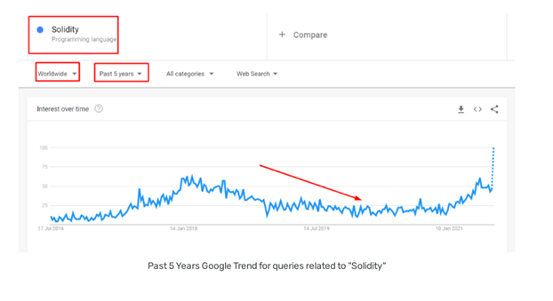
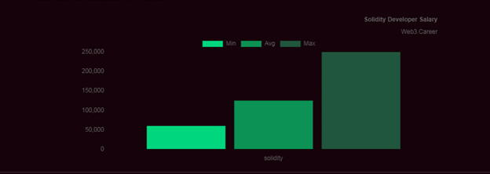
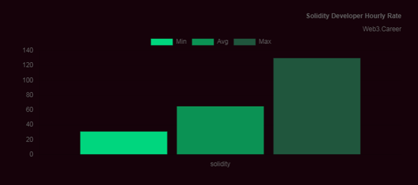

  

## درآمد برنامه نویسی سالیدیتی

با افزایش محبوبیت و استفاده از فناوری بلاکچین، توسعه دهندگان جدید و موجود به دنبال موقعیت‌های تمام وقت در وب ۳ هستند. طبق وبسایت  cryptocurrencyjobs.co، با حقوق رده پایین ۸۰,۰۰۰ دلار و حقوق رده بالا ۱۸۰,۰۰۰ دلار، برای توسعه دهندگان سالیدیتی (Solidity)  میانگین حقوق پایه  در ایالات متحده ۱۲۷,۵۰۰ دلار است. این رقم ممکن است بر اساس مکان، شرکت و تجربه متفاوت باشد.

این مقاله به این موضوع می‌پردازد که چرا تقاضا برای توسعه‌دهندگان سالیدیتی در حال افزایش است و توسعه‌دهندگان با دریافت یک شغل توسعه‌دهنده سالیدیتی به عنوان کارآموز، توسعه‌دهنده سطح ابتدایی، توسعه‌دهنده جونیور و سنیور تا چه اندازه می‌توانند انتظار دریافت دستمزد را داشته باشند.

### توسعه دهنده سالیدیتی چه کاری انجام می‌دهد؟\

توسعه دهندگان سالیدیتی با استفاده از سالیدیتی— زبان برنامه نویسی بومی اتریوم، قراردادهای هوشمند را بر روی برنامه های کاربردی مبتنی بر اتریوم طراحی، ایجاد، استقرار و مدیریت می‌کنند. توسعه‌دهندگان سالیدیتی برای شرکت‌های سازمانی در بخش‌های بلاکچین، در استارت‌آپ‌های وب ۳ ، پروتکل‌های بلاکچین و برخی از توسعه‌دهندگان به‌عنوان فریلنسر کار می‌کنند که در پروژه‌های منبع باز مشارکت می‌کنند. از آنجایی که وب 3 جهانی است، بسیاری از مهندسان سالیدیتی می‌توانند از راه دور کار کنند.

### شرح شغل توسعه دهنده سالیدیتی

توسعه دهندگان سالیدیتی معمولاً مسئول وظایف شغلی زیر هستند:
<ul>
 	<li>توسعه  (Develope) و استقرار (deploy)  قراردادهای هوشمند ایمن و کارآمد از گس</li>
 	<li>انجام آدیت قراردادهای هوشمند و تست نفوذ</li>
 	<li>ادغام‌های خاص برنامه</li>
 	<li> ارائه پشتیبانی برای ادغام</li>
 	<li>اعمال بهترین شیوه‌ها در مورد کیفیت کد</li>
 	<li>همکاری با مدیران محصول و تیم‌های چند رشته‌ای</li>
 	<li>رابط با رهبران پروژه و جامعه</li>
 	<li> ارزیابی ابزارهای جدید و مخازن گیتهاب  (Github) برای بهبود کیفیت محصول</li>
</ul>

این موارد یک مقطع کوچک از آنچه توسعه دهندگان سالیدیتی مسئول آن هستند، می‌باشد.

### چرا برنامه نویسان سالیدیتی اینقدر تقاضا دارند؟

سالیدیتی اولین زبان برنامه نویسی وب 3 است که برای ساخت برنامه‌های کاربردی مبتنی بر بلاکچین با قراردادهای هوشمند استفاده می‌شود و به عنوان رهبر صنعت، با ورود سازندگان بیشتری از سال 2015 (1394) به این فضا، بسیاری سالیدیتی را به عنوان زبان برنامه نویسی اصلی وب 3 خود انتخاب کرده‌اند. پیش‌بینی‌های Custom Market Insights نشان می‌دهد که «بازار فناوری بلاکچین» تا سال 2030 (1409) با نرخ رشد مرکب سالانه 65 درصد به رشد خود ادامه خواهد داد.

  
  
 آمار تقاضا برای برنامه نویسان سالیدتی 

---

### 5 دلیل برای افزایش تقاضا برای توسعه دهندگان سالیدیتی

سالیدیتی یک زبان برنامه نویسی شی گرا است که برای طراحی قراردادهای هوشمند در شبکه اتریوم ایجاد شده است. با افزایش پروتکل‌های بلاکچین و قراردادهای هوشمند ایجاد شده در شبکه اتریوم و بلاکچین‌های سازگار با EVM، تقاضا برای توسعه دهندگان سالیدیتی در حال افزایش است.

<ol style="text-align: justify;">
 	<li>محبوبیت فناوری بلاکچین، سالیدیتی از نظر محبوبیت دو برابر بیشتر از هر زبان برنامه نویسی دیگری برتری دارد.</li>
 	<li>شبکه های سازگار با EVM، چندین لایه یک (L1) و زنجیره جانبی از سالیدیتی از جمله پالیگان، آوالانچ، پولکادات، جیره بایننس و بسیاری دیگر استفاده می‌کنند.</li>
</ol>

3.محصولات دیفای: سالیدیتی زبان برنامه نویسی اولیه در امور مالی غیرمتمرکز (DeFi)  است،  صنعت چند میلیارد دلاری که بسیاری در آن فعال هستند.

<ol start="4">
 	<li style="text-align: justify;">توسعه وب 3 : وب 3 در حال جذب مهندسان جدید است و سالیدیتی بهترین مقدمه برای یادگیری توسعه وب 3 در نظر گرفته می‌شود.</li>
 	<li style="text-align: justify;">عرضه و تقاضا: توسعه دهندگان سالیدیتی کافی برای برآوردن تقاضای شرکت های وب2 و وب3 که وارد فضای بلاکچین می شوند وجود ندارد.</li>
</ol>

### میانگین حقوق توسعه دهندگان سالیدیتی چقدر است؟

میانگین دستمزد توسعه دهندگان سالیدیتی به تجربه و موقعیت جغرافیایی آنها بستگی دارد و حقوق سالانه آن از 25000 تا 225000 دلار در سال متغیر است. موارد زیر میانگین دستمزد را با توجه به هر سطح تجربه توسعه‌دهنده سالیدیتی ارائه می‌کند: کارآموز، سطح ابتدایی ، جوان یا همان جونیور و ارشد یا همان سنیور.

### کارآموز توسعه دهنده سالیدیتی

کارآموزی توسعه دهندگان سالیدیتی نادر است، اما زمانی که رخ می‌دهد، معمولا برای چند ماه است و به صورت حقوقی پرداخت نمی‌شود. اگر بخواهید نرخ کارآموزی را بر اساس حقوق افزایش داشته باشید، بسته به شرکت و محل کارآموزی، میانگین آن بین 25000 تا 50000 دلار خواهد بود.

### توسعه دهنده سطح ورودی سالیدیتی

یک توسعه دهنده پایه سالیدیتی ممکن است برای یک استارت آپ در مرحله اولیه، یک پروژه منبع باز یا به عنوان یک شرکت تاسیس شده وب 3 کار کند. توسعه‌دهندگان سالیدیتی در سطح ورودی طبق web3.career می‌توانند میانگین دستمزد بین 45000 تا 90000 دلار را انتظار داشته باشند.

پایین‌تر از این محدوده به سمت توسعه‌دهندگان بین‌المللی و از راه دور یا همان ریموت که در آن هزینه‌های زندگی ارزان‌تر است، می‌باشد.

حقوق ورودی بالاتر 90000 دلار و بالاتر، به احتمال زیاد به توسعه دهندگان سالیدیتی که برای یک استارت آپ مثبت کار می‌کنند، یا شرکتی که سری جمع آوری سرمایه بزرگ را تکمیل کرده است، پرداخت می‌شود.

### توسعه‌دهنده جونیور

از آنجایی که توسعه دهندگان سالیدیتی در سطح جونیور وظایف پیچیده‌تری را بر عهده می‌گیرند، توسعه دهندگان سطح ابتدایی را مدیریت و آموزش می‌دهند و به طور کلی مسئولیت‌های بیشتری دارند، میانگین دستمزد توسعه دهندگان سالیدیتی در سطح جونیور بین 90000 تا 120000 دلار متغیر است.

### توسعه دهنده ارشد یا سنیور

تقاضا برای توسعه دهندگان ارشد باتجربه سالیدیتی در سال 2022 به بالاترین حد خود رسیده بود و دستمزد برای توسعه دهندگان با تجربه و سطح ارشد سالیدیتی از 120000 تا 225000 دلار غرامت نقدی متغیر است.

### توسعه دهنده مستقل

نرخ توسعه دهندگان فریلنس سالیدیتی در وب سایت‌های مختلف شغلی متفاوت است. به طور متوسط، یک برنامه نویس مستقل سالیدیتی در ساعت 81 تا 100 دلار دریافت می‌کند. نرخ ساعتی ممکن است به 350 دلار در ساعت بر اساس تخصص توسعه دهنده افزایش یابد.

### مشوق‌های توکن و گزینه سهام

بسته به نوع شرکتی که با آن کار می‌کنید، علاوه بر حقوق های نقدی، توسعه دهندگان سالیدیتی ممکن است مشوق‌های مالی بیشتری دریافت کنند. به عنوان مثال، یک پروتکل منبع باز ممکن است مشارکت‌کنندگان اصلی تمام وقت با سهام مبتنی بر توکن را ارائه دهد و استارت آپ‌های دارای پشتوانه سرمایه گذاری گزینه‌های سهام کارکنان را ارائه دهند.

### حقوق توسعه دهندگان Solidity چگونه با حقوق توسعه دهندگان وب2 مقایسه می‌شود؟

بر اساس O*Net Online، یک پایگاه داده شغلی، 10 درصد برتر مهندسان بلاکچین در سانفرانسیسکو بیش از 208000 دلار در سال درآمد دارند و این همان حقوق سالانه گزارش شده برای 10 درصد از توسعه دهندگان نرم افزار در سانفرانسیسکو است. برای مقایسه، اداره آمار کار (BLS)، 10 درصد برتر توسعه دهندگان نرم افزار بیش از 153250 دلار درآمد دارند.

از آنجایی که وب3 یک صنعت جدید است، میزان حقوق واقعی توسعه دهندگان برتر سالیدیتی در مقایسه با پردرآمدترین شرکت های وب2 مانند FAANG )فیس بوک، آمازون، اپل، نتفلیکس و گوگل) چندان قابل مشاهده نیست.

از آنجایی که بلاکچین یک صنعت جدید، با رشد بالا و پرسود است، کمبود برنامه نویسان سالیدیتی می‌تواند منجر به افزایش حقوق و دستمزدهای غیر نقدی مانند توکن‌ها یا سهام شود.

بر اساس گزارش Indeed، حقوق مهندسان ارشد نرم افزار وب2 بین 87 تا 179 هزار دلار است که معمولاً برای یک مهندس وب2 میزان 5 تا 15 سال تجربه برای رسیدن به این نرخ حقوق لازم است، به جز در شرکت های مشابه FAANG که بالاترین درآمد را دارند. در مقابل، از آنجایی که سالیدیتی یک زبان برنامه نویسی جدید با تقاضای باورنکردنی در بازار است، یک توسعه دهنده ارشد سالیدیتی ممکن است تنها با 2 تا 3 سال تجربه به محدوده حقوقی مشابهی دست پیدا کند.

### بررسی حقوق سالیانه یک توسعه دهنده سالیدیتی

**خوب بریم چندتا نمودار رو هم از وبسایت web3.career  بررسی کنیم:**

متوسط حقوق سالانه یک توسعه دهنده سالیدیتی با حداقل حقوق پایه 60 هزار دلار و حداکثر 250 هزار دلار،  125 هزار دلار در سال است.

**نرخ ساعتی توسعه دهنده سالیدیتی**

میانگین نرخ ساعتی سالیدیتی دولوپر 65 دلار در ساعت است (با حداقل نرخ ساعتی 31 دلار و حداکثر نرخ ساعتی 130 دلار در ساعت).

  
  
 کسب درآمد از سالیدیتی 

---

### نرخ ساعتی توسعه دهنده سالیدیتی
میانگین نرخ ساعتی سالیدیتی دولوپر 65 دلار در ساعت است (با حداقل نرخ ساعتی 31 دلار و حداکثر نرخ ساعتی 130 دلار در ساعت).

  
  
 نرخ درآمد سالیدیتی بر اساس ساعت 

