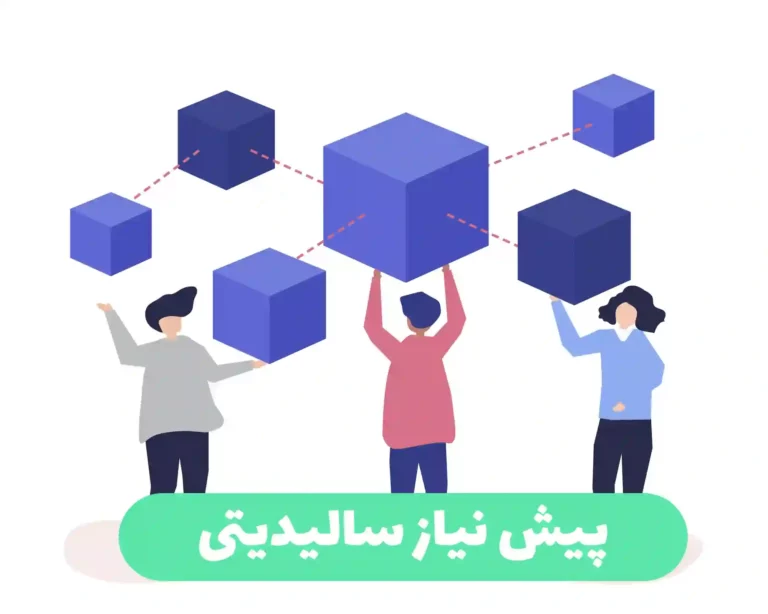

  

## سالیدیتی چیست؟

سالیدیتی یک زبان شیءگرا و سطح بالا برای پیاده‌سازی قراردادهای هوشمند است. قراردادهای هوشمند برنامه‌هایی هستند که رفتار حساب‌ها درون حالت اتریوم را تنظیم می‌کنند.

سالیدیتی یک زبان با دستورات و پرانتز درونی است که برای هدف‌گیری به ماشین مجازی اتریوم (EVM) طراحی شده است. این زبان تحت تأثیر C++، Python و جاواکسریپت قرار گرفته است. جزئیات بیشتری درباره زبان‌هایی که Solidity تأثیر گرفته است، در بخش تأثیرهای زبانی قابل یافتن است.

سالیدیتی نوع‌دهی بررسی‌شده، ارث بری، کتابخانه‌ها و انواع تعریف شده توسط کاربر را پشتیبانی می‌کند، به همراه ویژگی‌های دیگر.

با استفاده از Solidity، می‌توانید قراردادهایی برای کاربردهایی مانند رأی‌گیری، جمع‌آوری سرمایه، حراجی ناشناس و کیف پول‌های چندامضا ایجاد کنید.

هنگام استقرار قراردادها، باید از آخرین نسخه منتشرشدهٔ Solidity استفاده کنید. به جز موارد استثنایی، فقط آخرین نسخه دارای بهبودهای امنیتی می‌باشد. علاوه بر این، تغییرات عمدهٔ نسخهٔ Solidity و همچنین ویژگی‌های جدید به صورت منظم معرفی می‌شوند. در حال حاضر، از شماره نسخه با فرمت 0.y.z برای نشان دادن این تغییرات سریع استفاده می‌شود.

### کاربرد زبان سالدیتی

زبان Solidity یک زبان برنامه‌نویسی متمرکز بر قراردادهای هوشمند است که بر روی پلتفرم اتریوم اجرا می‌شود. این زبان به منظور توسعه و اجرای قراردادهای هوشمند در بلاکچین اتریوم طراحی شده است. دارای کاربردهای متنوعی است که می‌توان به موارد زیر اشاره کرد:

<ol>
<li>قراردادهای هوشمند (Smart Contracts): اصلی‌ترین کاربرد Solidity در توسعه قراردادهای هوشمند است. قراردادهای هوشمند، قوانین و شروطی را برای انجام تراکنش‌ها و عملیات در بلاکچین تعریف می‌کنند. با استفاده از Solidity، می‌توانید قراردادهای هوشمندی برنامه‌ریزی کنید که عملکرد خاصی را انجام دهند، از جمله انتقال توکن‌ها، رای‌گیری، رمزنگاری اطلاعات و غیره.</li>
</ol>

<ol>
<li>توسعه توکن‌های استاندارد: اغلب پروژه‌های بر پایه اتریوم از توکن‌ها برای نمایندگی ارزها، دارایی‌ها و سایر منابع استفاده می‌کنند. با Solidity، می‌توانید توکن‌های قابل تبادل را تعریف کنید، صاحبان جدید به آن‌ها دسترسی داشته باشند و قابلیت‌های مختلفی مانند توزیع بر اساس قوانین مشخص، تعداد محدودیت شده و غیره را برای آن‌ها در نظر بگیرید.</li>

<li>توسعه DApps (Decentralized Applications): با استفاده از Solidity، می‌توانید برنامه‌های تحت وب تماماً متمرکز بر بلاکچین اتریوم بسازید. این برنامه‌ها که به عنوان DApps شناخته می‌شوند، از قراردادهای هوشمند جهت انجام عملیات و تبادل اطلاعات با استفاده از بلاکچین بهره می‌برند. Solidity ابزاری قوی برای توسعه این نوع برنامه‌هاست.</li>

<li>آزمون و ایمنی: Solidity ابزارها و کتابخانه‌هایی را در اختیار برنامه‌نویسان قرار می‌دهد که به آن‌ها کمک می‌کند تا قراردادهای هوشمند را تست و بهبود بخشند. این ابزارها شامل ابزارهای آزمون و شبیه‌سازی، الگوهای طراحی امنیتی و جل</li>
</ol>

زبان Solidity یک زبان برنامه‌نویسی متمرکز بر قراردادهای هوشمند است که بر روی پلتفرم اتریوم اجرا می‌شود. این زبان به منظور توسعه و اجرای قراردادهای هوشمند در بلاکچین اتریوم طراحی شده است. دارای کاربردهای متنوعی است که می‌توان به موارد زیر اشاره کرد:

<ol>
<li>قراردادهای هوشمند (Smart Contracts): اصلی‌ترین کاربرد Solidity در توسعه قراردادهای هوشمند است. قراردادهای هوشمند، قوانین و شروطی را برای انجام تراکنش‌ها و عملیات در بلاکچین تعریف می‌کنند. با استفاده از Solidity، می‌توانید قراردادهای هوشمندی برنامه‌ریزی کنید که عملکرد خاصی را انجام دهند، از جمله انتقال توکن‌ها، رای‌گیری، رمزنگاری اطلاعات و غیره.</li>

<li>توسعه توکن‌های استاندارد: اغلب پروژه‌های بر پایه اتریوم از توکن‌ها برای نمایندگی ارزها، دارایی‌ها و سایر منابع استفاده می‌کنند. با Solidity، می‌توانید توکن‌های قابل تبادل را تعریف کنید، صاحبان جدید به آن‌ها دسترسی داشته باشند و قابلیت‌های مختلفی مانند توزیع بر اساس قوانین مشخص، تعداد محدودیت شده و غیره را برای آن‌ها در نظر بگیرید.</li>

<li>توسعه DApps (Decentralized Applications): با استفاده از Solidity، می‌توانید برنامه‌های تحت وب تماماً متمرکز بر بلاکچین اتریوم بسازید. این برنامه‌ها که به عنوان DApps شناخته می‌شوند، از قراردادهای هوشمند جهت انجام عملیات و تبادل اطلاعات با استفاده از بلاکچین بهره می‌برند. Solidity ابزاری قوی برای توسعه این نوع برنامه‌هاست.</li>

<li>آزمون و ایمنی: Solidity ابزارها و کتابخانه‌هایی را در اختیار برنامه‌نویسان قرار می‌دهد که به آن‌ها کمک می‌کند تا قراردادهای هوشمند را تست و بهبود بخشند. این ابزارها شامل ابزارهای آزمون و شبیه‌سازی، الگوهای طراحی امنیتی و جل</li>
</ol>

---

  

---

### مسیر یادگیری سالیدیتی

برای شروع برنامه نویسی به زبان سالیدیتی باید به مفاهیم مختلفی اشنا باشید البته باید گفت در هر سن و سالی که باشید هیچ گاه برای یادگیری دیر نیست فقط پشتکار و ممارست در یادگیری ناشدنی ترین کارهای را شدنی میکند در اینجا یک نقشه راه برای شروع سالیدیتی آورده ایم که میتوانید در هر سن وسالی هستید استفاده کنید و شروع کنید فقط شروع کنید همین گام اول را بردارید.

برای شروع یادگیری Solidity، می‌توانید این مراحل را دنبال کنید:

<ol>
<li>آشنایی با مفاهیم اساسی بلاکچین و قراردادهای هوشمند: پیش از شروع به یادگیری Solidity، بهتر است با مفاهیم اساسی بلاکچین و نحوه عملکرد قراردادهای هوشمند در اتریوم آشنا شوید. این شامل مطالعه درباره تکنولوژی بلاکچین، شبکه اتریوم و نحوه عملکرد قراردادهای هوشمند است.</li>

<li>آموزش Solidity: برای یادگیری Solidity، منابع آموزشی آنلاین متنوعی وجود دارد. می‌توانید از منابع رسمی Solidity مانند مستندات اتریوم استفاده کنید. همچنین، پیشنهاد می‌شود کتاب‌ها، ویدئوها و دوره‌های آنلاین Solidity را بررسی کنید. برخی از منابع آموزشی معروف شامل وبسایت Solidity، کتاب "Mastering Ethereum" و منابع آموزشی بلاکچین است.</li>

<li>تمرین و تجربه عملی: برای بهبود مهارت‌های خود در Solidity، توصیه می‌شود که با تمرین کدنویسی و پروژه‌های عملی روبرو شوید. می‌توانید از سایت‌ها و منابع آموزشی که تمرین‌ها و پروژه‌های عملی ارائه می‌دهند، استفاده کنید. همچنین، می‌توانید در جامعه Solidity و انجمن‌های برنامه‌نویسان بلاکچین شرکت کنید تا از دیگران یاد بگیرید و تجربیات خود را به اشتراک بگذارید.</li>

<li>مطالعه قراردادهای هوشمند موجود: یک راه مفید برای یادگیری Solidity، مطالعه قراردادهای هوشمند موجود است. با مرور و بررسی قراردادهای هوشمندی که توسط دیگران ایجاد شده‌اند، می‌توانید روش‌ها و الگوهای برنامه‌نویسی Solidity را بهتر فهمیده و از آنها الهام بگیرید.</li>

<li>به‌روزرسانی با تغییرات و بهبودهای جدید: Solidity به طور منظم به‌روزرسانی می‌شود و تغییرات و بهبودهایی در آن اعمال می‌شود. بنابراین، حائز اهمیت است که با تغییرات و نسخه‌های جدید Solidity در جریان باشید و قادر به استفاده از ویژگی‌های جدید آن باشید.</li>
</ol>

<ol start="6">
<li>انجام پروژه‌های عملی: برای تثبیت و تقویت مهارت‌های خود در Solidity، بهتر است پروژه‌های عملی را انجام دهید. طرح و پیاده‌سازی قراردادهای هوشمند ساده و کاربردی مانند سامانه رأی‌گیری یا کیف پول‌های چندامضا را به عنوان پروژه‌های شخصی انتخاب کنید. این کمک می‌کند تا تجربه عملی در برنامه‌نویسی Solidity را بدست آورید و با چالش‌های واقعی مواجه شوید.</li>

<li>عضویت در جامعه Solidity و انجمن‌های برنامه‌نویسی بلاکچین: فعال شدن در جامعه Solidity و انجمن‌های برنامه‌نویسی بلاکچین می‌تواند به شما کمک کند تا در ارتباط با دیگر برنامه‌نویسان Solidity قرار بگیرید، سوالات خود را مطرح کنید و از تجربیات دیگران بهره‌برداری کنید. این فضای اجتماعی برای یادگیری مستمر و به روزرسانی با جدیدترین تکنولوژی‌ها و الگوهای Solidity بسیار حائز اهمیت است.</li>

<li>ارتقاء مهارت‌های خود: همچنین، در طول مسیر یادگیری Solidity، پیشنهاد می‌شود بر مهارت‌های فنی و عمومی خود کار کنید. این شامل بهبود مهارت‌های برنامه‌نویسی عمومی، مفاهیم امنیتی، طراحی الگوریتم و مدیریت پروژه است. این مهارت‌ها به شما در توسعه قراردادهای هوشمند قدرت و اعتماد به نفس بیشتری می‌دهند.</li>

<li>مشارکت در پروژه‌های منبع باز: در صورت تسلط بر Solidity و قراردادهای هوشمند، می‌توانید در پروژه‌های منبع باز Solidity مشارکت کنید. این فرصت عالی است تا با برنامه‌نویسان حرفه‌ای در این زمینه همکاری کنید، تجربه گسترده‌تری بدست آورید و به جامعه Solidity سود بیشتری ببرید.</li>
</ol>

همچنین، مهم است که به روز باشید و تغییرات و بهبودهای جدید Solidity را دنبال کنید، زیرا این زبان به طور مداوم توسعه و به روزرسانی می‌شود.

با رعایت این مراحل و تمرین مداوم، می‌توانید به تسلط بر Solidity و قراردادهای هوشمند برسید. در ادامه، چند منبع آموزشی برای شروع یادگیری Solidity را معرفی می‌کنم:

<ol>
<li>وبسایت Solidity: وبسایت رسمی Solidity (https://soliditylang.org/) منابع، مستندات و آموزش‌های جامعی را در اختیار شما قرار می‌دهد. اینجا می‌توانید با نحوه استفاده از Solidity آشنا شوید، مثال‌ها را مطالعه کنید و دستورالعمل‌ها را پیگیری کنید.</li>

<li>سورس کد قراردادهای هوشمند: مرور سورس کد قراردادهای هوشمند موجود در شبکه اتریوم می‌تواند روش عالی‌ای برای یادگیری Solidity باشد. می‌توانید قراردادهای هوشمند معروفی مانند CryptoKitties، MakerDAO، Uniswap و غیره را بررسی کنید. با مطالعه سورس کد این قراردادها، الگوهای برنامه‌نویسی Solidity را به خوبی فهمیده و به تجربه واقعی نزدیک می‌شوید.</li>

<li>دوره‌های آموزشی آنلاین: برخی از وبسایت‌ها و پلتفرم‌های آموزشی آنلاین، دوره‌هایی جامع برای یادگیری Solidity ارائه می‌دهند. مثال‌هایی از این پلتفرم‌ها شامل Udemy، Coursera، LinkedIn Learning و Ethereum.org است. با مرور دوره‌های آموزشی Solidity در این پلتفرم‌ها، می‌توانید با مفاهیم پیشرفته‌تر و الگوهای پیچیده‌تر Solidity آشنا شوید.</li>

<li>کتاب "Mastering Ethereum": این کتاب توسط Gavin Wood و Andreas M. Antonopoulos نوشته شده است و به صورت جامع به مفاهیم اتریوم و Solidity می‌پردازد. این منبع مناسبی برای عمق‌گیری در Solidity و قراردادهای هوشمند است.</li>

<li>جامعه Solidity: پیوستن به جامعه Solidity و انجمن‌های برنامه‌نویسان بلاکچین می‌تواند در یادگیری شما بسیار کمک کند. با دریافت بازخوردها، پرسیدن سوالات و مشارکت در بحث‌ها، می‌توانید تجربه خود را افزایش دهید و از دیگران یاد بگیرید.</li>
</ol>

همچنین، توصیه می‌شود همیشه با استفاده از آخرین نسخه Solidity کار کنید و به روزرسانی‌ها و تغییرات جدید آن آگاه باشید. همچنین، از منابع آموزشی و مستندات رسمی Solidity بهره‌برداری کنید و با پروژه‌های عملی و همکاری در جامعه Solidity مهارت‌های خود را تقویت کنید.

---

  

---

### پیش نیاز سالیدیتی

برای شروع یادگیری Solidity، مفید است که در ابتدا به مفاهیم و تکنولوژی‌های زیر آشنا باشید:

۱. بلاکچین: بررسی مفهوم بلاکچین و تکنولوژی آن، مانند مفاهیم اصلی بلاکچین، تراکنش‌ها، دفترچه رکوردی توزیع‌شده، اثبات کار (Proof of Work) و اثبات سهام (Proof of Stake) بسیار مفید است.

۲. اتریوم: اتریوم یک پلتفرم قرارداد هوشمند است که برپایه بلاکچین عمل می‌کند. درک مفاهیم اساسی اتریوم، مانند شبکه اتریوم، زبان برنامه‌نویسی Solidity و مفاهیم کلیدی مانند گاز (Gas) و قراردادهای هوشمند اتریوم، به شما در یادگیری Solidity کمک خواهد کرد.

۳. زبان برنامه‌نویسی: آشنایی با اصول و مفاهیم برنامه‌نویسی، مانند متغیرها، عملگرها، حلقه‌ها، توابع و ساختارهای کنترل جریان مفید است. اگر قبلاً با زبان‌های برنامه‌نویسی مانند جاوااسکریپت یا پایتون آشنایی دارید، به شما در یادگیری Solidity کمک خواهد کرد.

۴. ترمینولوژی‌های بلاکچین: برخی اصطلاحات مرتبط با بلاکچین و قراردادهای هوشمند مانند ماینرها، تراکنش‌های مذکور، نشانی‌های بلاکچین (Addresses) و ABI (Application Binary Interface) را مطالعه کنید.

۵. امنیت: درک مفاهیم امنیتی مرتبط با قراردادهای هوشمند بسیار حائز اهمیت است. ترفندها و روش‌هایی مانند تهاجم‌های Reentrancy، تهاجم‌های تغییر وضعیت (State Change Attacks) و تهدیدهای امنیتی دیگر را مطالعه کنید.

با درک این مفاهیم و پیش نیازها، شروع به یادگیری Solidity می‌کنید و می‌توانید قراردادهای هوشمند اتریوم قدرتمندی بسازید.